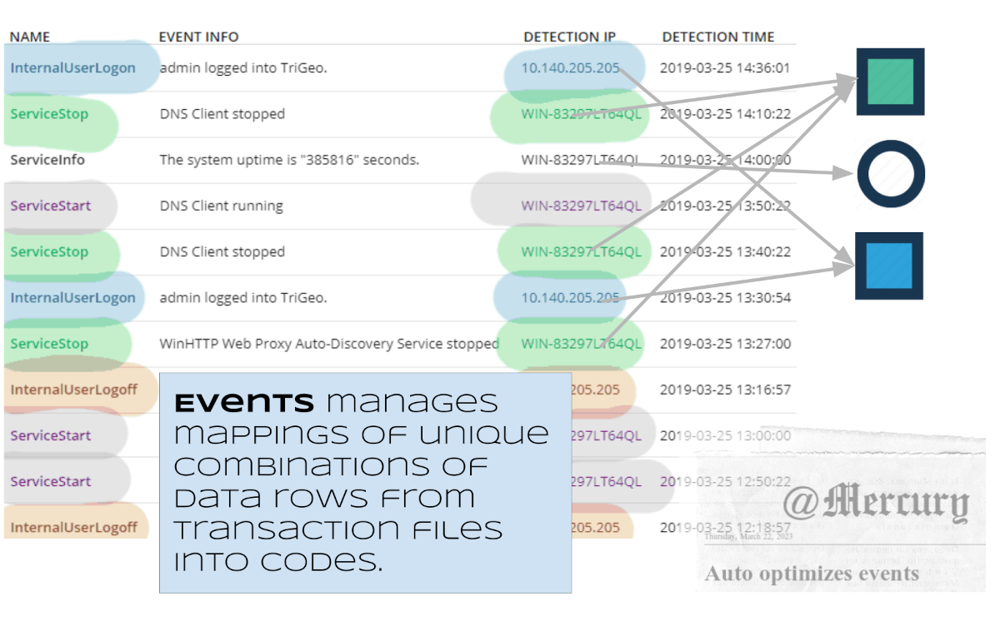
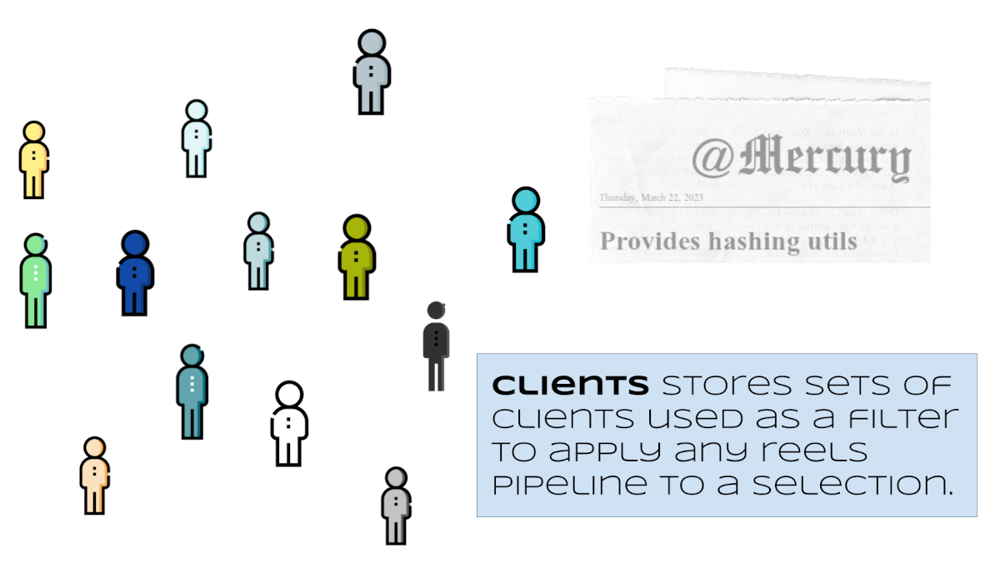
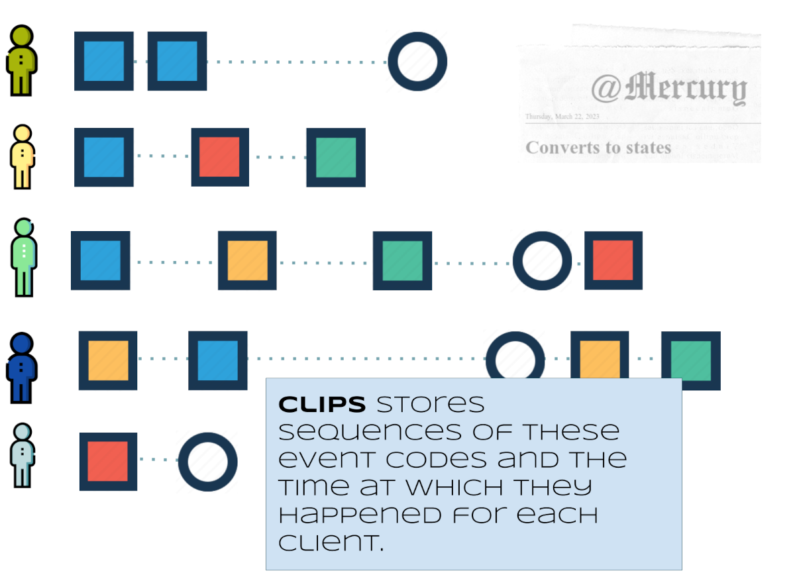
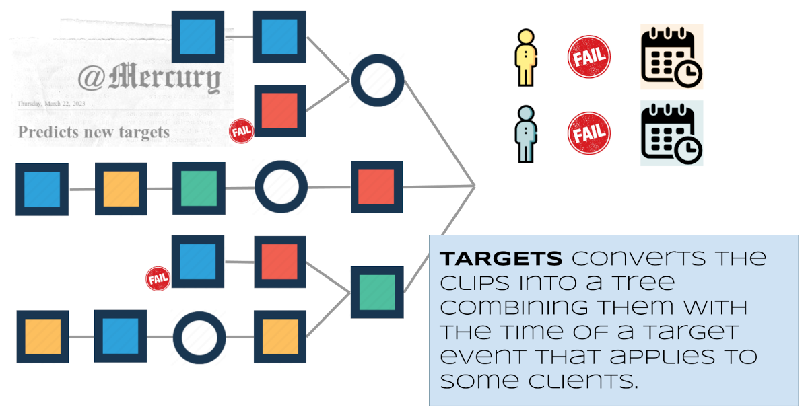

# Mercury Reels

## What is this?

### TLDR: Reels helps identify patterns in event data and can predict target events.

**Reels** is a library to analyze sequences of events extracted from transactional data. These events can be automatically discovered
or manually defined. **Reels** identifies events by assigning them **event codes** and creates **clips**, which are sequences of
**(code, time of occurrence)** tuples for each **client**. Using these clips, a model can be generated to predict the time at which
**target events** may occur in the future.

### What problems is REELS good for?

Reels was born to analyze web navigation transactional data. It has natural applications in cybersecurity and everywhere where predicting
**events** or scoring **risk of events** based on past events makes sense. The definition of **relevant event** may be discovered from
transactional data or is established as business domain knowledge. It can also be semi-automated using Reels event optimizer to iterate
and learn how events predict a target.

### What data size can reels tackle?

Reels is a C++ implementation with a Python interface. It is single threaded and can seamlessly operate over millions of clients and
billions of records with hundreds of thousands of events. To further parallelize, it can partition the data by dividing the set of
clients into smaller subsets and operate on each subset independently.

### I already have time series and sequence prediction tools, why would I need another one?

  * Reels is oriented towards **events** (as opposed to continuous variables like a price).
  * Even when your problem is better seen as time series, Reels predictions can be used as features to boost another model.
  * Supports manual, full automatic or assisted definition of what relevant (predictive) events are.
  * Predicts a target event within or outside the transactional dataset.
  * Highly efficient C++ implementation.
  * 100% pythonic interface: objects are serializable, use iterators, interfaces with pandas and pyspark.

## The Python API

Reels is implemented in four classes.

### The Events class


  * [Python API](__doc__/reference/python/events/)
  * [C++ API](__doc__/reference/html/classreels_1_1Events.html)

### The Clients class


  * [Python API](__doc__/reference/python/clients/)
  * [C++ API](__doc__/reference/html/classreels_1_1Clients.html)

### The Clips class


  * [Python API](__doc__/reference/python/clips/)
  * [C++ API](__doc__/reference/html/classreels_1_1Clips.html)

### The Targets class


  * [Python API](__doc__/reference/python/targets/)
  * [C++ API](__doc__/reference/html/classreels_1_1Targets.html)

## Try it without any installation on Google Colab

  * [Introductory: A walk through Reels](__doc__/notebooks/reels_walkthrough.ipynb)
  * [Advanced: Event optimization -- How to do assisted event discovery](__doc__/notebooks/event_optimization.ipynb)

## Install

```bash
pip install mercury-reels
```

## Documentation

  * [Python API](__doc__/reference/python/reels/)
  * [C++ API](__doc__/reference/html/index.html)
  * [Algorithm description: Reels -- An efficient tree-based event prediction algorithm](__doc__/reference/reels_paper/)

## License

```text
                         Apache License
                   Version 2.0, January 2004
                http://www.apache.org/licenses/


     Copyright 2022-23, Banco de Bilbao Vizcaya Argentaria, S.A.

   Licensed under the Apache License, Version 2.0 (the "License");
   you may not use this file except in compliance with the License.
   You may obtain a copy of the License at

       http://www.apache.org/licenses/LICENSE-2.0
```